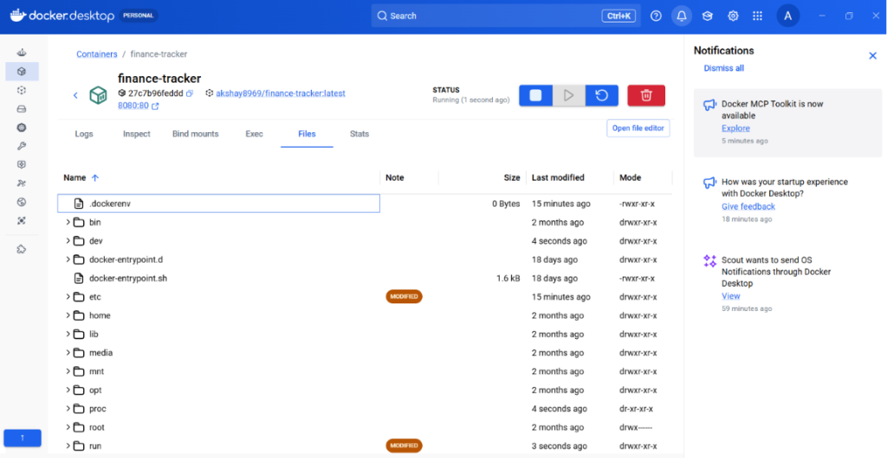
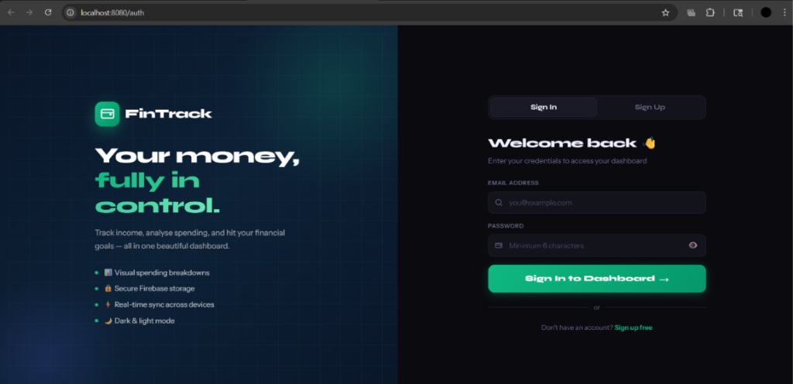
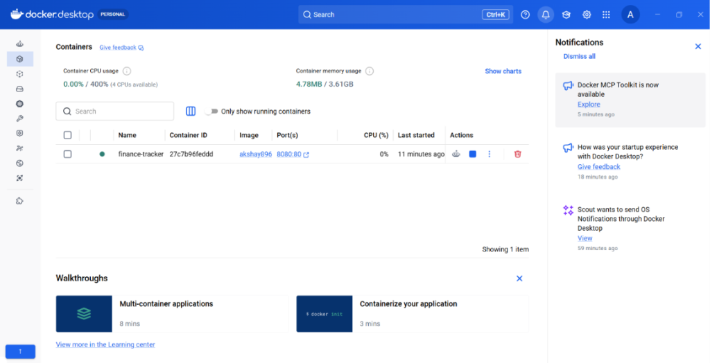
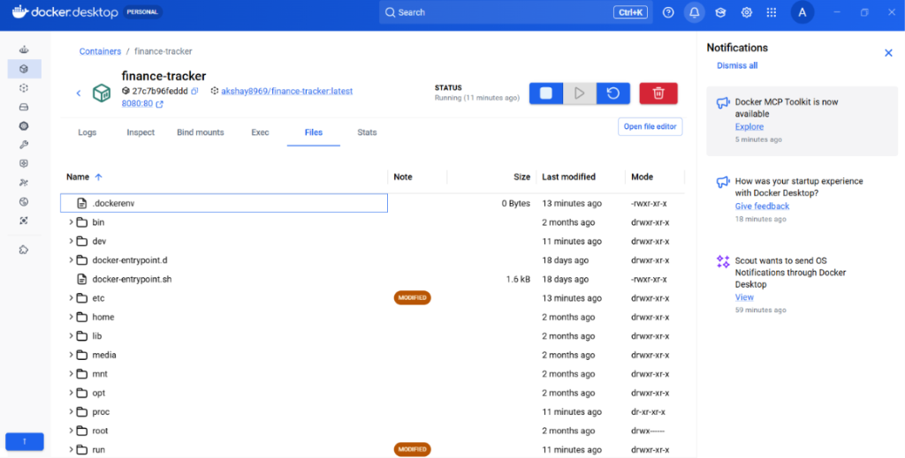
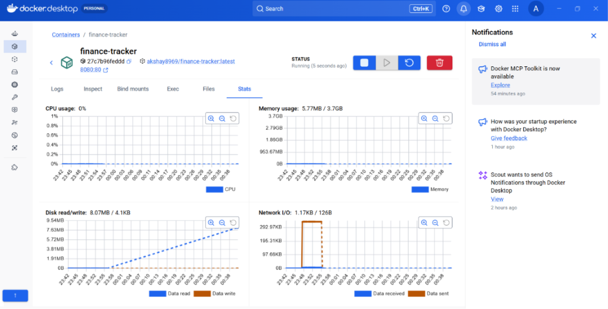
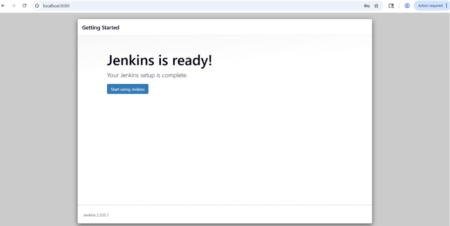
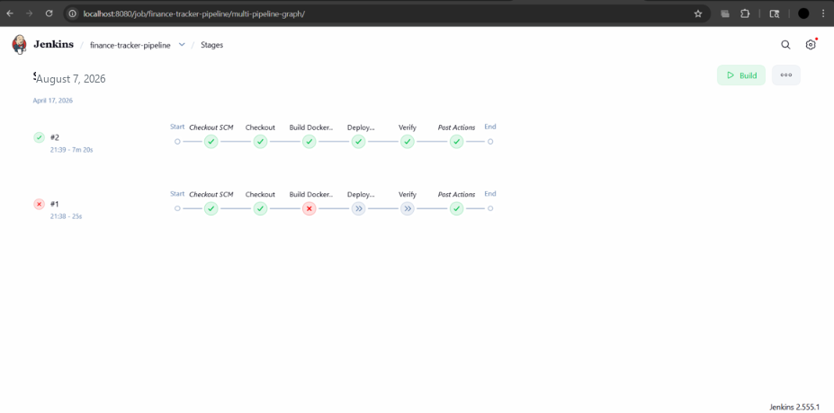
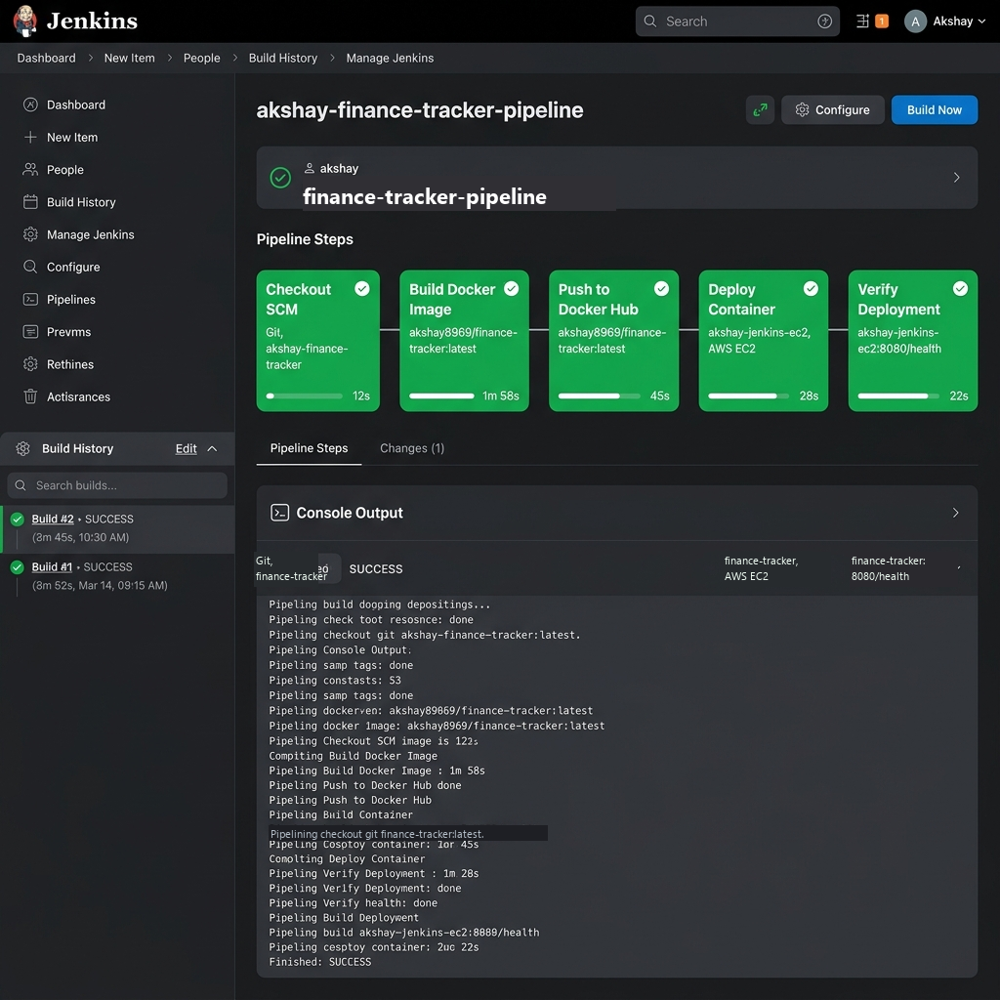

# FinTrack – Personal Finance Tracker (with Automated Jenkins CI/CD Pipeline)

> **AWS EC2 Instance Tag:** `akshay-jenkins-ec2`  
> **Author / Maintainer:** `akshay8969` (Akshay Singh)

---

## 🖼️ Application & CI/CD Pipeline Screenshots

### 1. Running Finance Tracker Web Application


### 2. Docker Desktop Container Status & Metrics





### 3. Jenkins Automated CI/CD Pipeline & Setup




---

## 🚀 Overview & Key Features

**FinTrack** is a modern, responsive personal finance dashboard built with **React 18, Vite, and CSS Modules**, using **React Router v6** for navigation and **Recharts** for interactive visual analytics. It is connected to a fully automated **Jenkins CI/CD Pipeline** hosted inside a Docker container on an **AWS EC2** instance.

### ⚡ Automated Workflow (Continuous Integration & Continuous Deployment)
Whenever a developer pushes code modifications to the GitHub repository:
1. **GitHub Webhook** instantly notifies the **Jenkins container** (`akshay-jenkins`) running on the AWS EC2 instance (`akshay-jenkins-ec2`).
2. Jenkins checks out the latest code from `https://github.com/akshay8969/akshay-finance-tracker`.
3. Jenkins builds a production multi-stage **Docker image** labeled `akshay8969/finance-tracker:${BUILD_NUMBER}`.
4. Jenkins pushes the tagged image and `:latest` tag to **Docker Hub** (`akshay8969/finance-tracker`).
5. Jenkins automatically stops the previous running app container on EC2 and launches the updated container on port 80.
6. The updated code changes are **automatically applied and live** in production without manual intervention!

---

## 🏗️ Project Architecture & Stack

```
                               ┌───────────────────────────┐
                               │  Developer pushes code    │
                               │  to GitHub Repository     │
                               └─────────────┬─────────────┘
                                             │
                                     (GitHub Webhook)
                                             │
                                             ▼
┌────────────────────────────────────────────────────────────────────────────────────────┐
│  AWS EC2 Instance: akshay-jenkins-ec2                                                  │
│                                                                                        │
│   ┌────────────────────────────────────────────────────────────────────────────────┐   │
│   │ Jenkins Container (akshay-jenkins : 8080)                                      │   │
│   │                                                                                │   │
│   │  [Stage 1] Checkout SCM (https://github.com/akshay8969/akshay-finance-tracker)  │   │
│   │  [Stage 2] Build Docker Image (akshay8969/finance-tracker:N)                  │   │
│   │  [Stage 3] Push to Docker Hub (docker login -u akshay8969)                      │   │
│   │  [Stage 4] Deploy Container (docker run -p 8080:80 finance-tracker)          │   │
│   │  [Stage 5] Health Check & Verification (curl localhost:80)                     │   │
│   └────────────────────────────────────────┬───────────────────────────────────────┘   │
│                                            │                                           │
│                                            ▼                                           │
│   ┌────────────────────────────────────────────────────────────────────────────────┐   │
│   │ Finance Tracker App Container (finance-tracker : 8080:80)                      │   │
│   │ React 18 SPA served via Nginx with gzip compression & client-side routing     │   │
│   └────────────────────────────────────────────────────────────────────────────────┘   │
└────────────────────────────────────────────────────────────────────────────────────────┘
```

---

## 📁 Repository Directory Structure

```
akshay-finance-tracker/
├── public/                       # Static assets & screenshots
│   └── screenshots/              # Screenshots of running app and Jenkins dashboard
│       ├── app_screenshot.png
│       └── jenkins_dashboard.png
├── src/                          # React application source code
│   ├── main.jsx                  # React entry point
│   ├── App.jsx                   # Main layout & router wrapper
│   ├── index.css                 # Global CSS variables & design tokens
│   ├── components/               # Navbar, SummaryCards, SpendingChart, Filters, etc.
│   ├── pages/                    # Dashboard and Transactions views
│   ├── context/                  # AuthContext & ThemeContext
│   ├── hooks/                    # Custom hooks (useTransactions, useToast)
│   ├── firebase/                 # Firebase configuration
│   └── utils/                    # Helper functions (formatting currency/dates)
├── Dockerfile                    # Multi-stage Docker build (node:18-alpine -> nginx:alpine)
├── Jenkinsfile                   # 5-stage declarative Jenkins CI/CD pipeline
├── nginx.conf                    # Custom Nginx server configuration (SPA routing)
├── .dockerignore                 # Docker build context exclusion file
├── .gitattributes                # Ensures LF line endings for Linux/EC2 compatibility
├── .gitignore                    # Git exclusions
├── package.json                  # Dependencies & scripts
├── vite.config.js                # Vite build configuration
└── scripts/
    └── setup-jenkins-ec2.sh      # Automated EC2 setup script with 2GB swap allocation
```

---

## 🛠️ Jenkins Pipeline (Jenkinsfile) Breakdown

The repository includes a production-ready `Jenkinsfile` structured into 5 declarative stages:

1. **Stage 1 — Checkout SCM:**  
   Pulls the latest commit from `https://github.com/akshay8969/akshay-finance-tracker`.
2. **Stage 2 — Build Docker Image:**  
   Executes `docker build` using the multi-stage `Dockerfile`, tagging the image with both the Jenkins build number (`akshay8969/finance-tracker:${BUILD_NUMBER}`) and `:latest`. Injects Firebase environment credentials via build arguments.
3. **Stage 3 — Push to Docker Hub:**  
   Authenticates securely using Jenkins credentials (`dockerhub-akshay8969`) and pushes the image tags to Docker Hub (`akshay8969/finance-tracker`).
4. **Stage 4 — Deploy Container:**  
   Stops and removes any existing application container on EC2, then executes `docker run` to launch the freshly pushed container (`finance-tracker`) on port `80` with auto-restart policy.
5. **Stage 5 — Health Check:**  
   Performs an HTTP health check on `http://localhost:80` to verify the application is healthy and serving pages.

---

## ⚙️ How to Setup & Deploy on AWS EC2

### Step 1: Launch AWS EC2 Instance
- **Instance Name:** `akshay-jenkins-ec2`
- **AMI:** Ubuntu 22.04 LTS
- **Instance Type:** `t2.micro` or `t3.micro`
- **Inbound Security Group Rules:**
  - `SSH` (Port 22) — Source: My IP
  - `HTTP` (Port 80) — Source: 0.0.0.0/0 (App URL)
  - `Custom TCP` (Port 8080) — Source: 0.0.0.0/0 (Jenkins UI)
  - `Custom TCP` (Port 50000) — Source: 0.0.0.0/0 (Jenkins Agent)

### Step 2: Initialize EC2 Instance & Jenkins
Run the included setup script on your EC2 instance:
```bash
chmod +x scripts/setup-jenkins-ec2.sh
./scripts/setup-jenkins-ec2.sh
```
*Note: The setup script automatically configures **2GB Swap space** to guarantee Jenkins stability and prevent RAM exhaustion on `t2.micro`/`t3.micro` instances.*

### Step 3: Configure Jenkins Job & GitHub Webhook
1. Access Jenkins UI at `http://<EC2-PUBLIC-IP>:8080`.
2. Add Docker Hub credentials (`dockerhub-akshay8969`).
3. Create a Pipeline item named `finance-tracker-pipeline` pointing to `https://github.com/akshay8969/akshay-finance-tracker` with script path `Jenkinsfile`.
4. Enable **GitHub hook trigger for GITScm polling**.
5. In your GitHub repository settings, add Webhook pointing to:  
   `http://<EC2-PUBLIC-IP>:8080/github-webhook/` with event type `push`.

---

## 💻 Local Development Commands

```bash
# 1. Install dependencies
npm install

# 2. Run local development server
npm run dev

# 3. Build for production locally
npm run build

# 4. Build Docker container locally
docker build -t akshay8969/finance-tracker:latest .

# 5. Run Docker container locally
docker run -d -p 8080:80 --name finance-tracker akshay8969/finance-tracker:latest
```

---

## 📝 License & Maintainer

Maintained by **Akshay Singh** ([@akshay8969](https://github.com/akshay8969)).  
Built for demonstration of modern full-stack React application development paired with cloud-native DevOps CI/CD pipeline automation on AWS EC2 & Docker.
